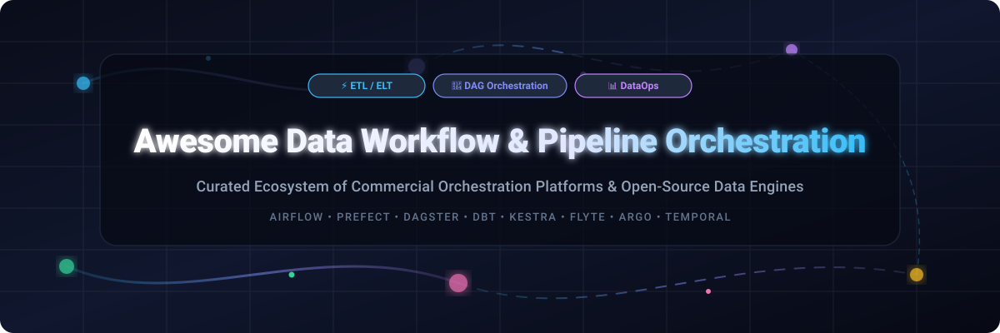

# Awesome-Data-Workflow-Pipeline-Orchestration 🔄 📊

  

  
  
  
  
  
  

---

## 🌟 Top Data Workflow & Pipeline Orchestration Ecosystem

**Curated List of Commercial Orchestration Platforms & Open-Source Data Pipeline Tools**  
*Focused on DAG Scheduling, Data Transformation, ELT/ETL, Data Quality, Observability & Self-Hosted Workflow Engines*

**Last updated: October 2026** 📅

---

### 📌 Overview & SEO Summary

Welcome to the definitive, search-optimized directory of **data workflow orchestration platforms**, **open-source data pipeline engines**, and **ELT/ETL frameworks**. Modern DataOps and platform engineering rely on robust directed acyclic graph (DAG) scheduling, automated data dependency management, real-time observability, and scalable infrastructure. 

This guide evaluates leading enterprise SaaS platforms (such as *AWS Data Pipeline*, *Google Cloud Composer*, *Azure Data Factory*, *dbt Cloud*, and *Fivetran*) alongside top open-source projects (*Apache Airflow*, *Temporal*, *Prefect*, *Dagster*, *Kestra*, *Windmill*, *Argo Workflows*, and *Flyte*).

---

## 📑 Table of Contents

- [📈 Sector Market Size & Market Structure](#-sector-market-size--market-structure)
- [🏢 SaaS & Commercial Platforms](#-saas--commercial-platforms)
- [🔓 Open-Source GitHub Projects](#-open-source-github-projects)
- [🛠️ How to Contribute](#%EF%B8%8F-how-to-contribute)
- [📊 Star History](#-star-history)
- [🤝 Support & Sponsorship](#-support--sponsorship)
- [⚠️ Disclaimer](#%EF%B8%8F-disclaimer)

---

## 📈 Sector Market Size & Market Structure

> [!NOTE]
> **Market Insights (2026):** The global data workflow orchestration and data integration software market is estimated at **$8.2 Billion** in 2026 and is projected to reach **$18.5 Billion by 2030** (CAGR of **17.6%**). The sector is **moderately fragmented**: cloud hyperscalers (Microsoft, AWS, Google) dominate foundational infrastructure integration, while specialized cloud platforms (dbt Labs, Fivetran, Astronomer) and developer-first open-source engines (Prefect, Dagster, Kestra, Temporal) capture developer mindshare through programmatic APIs, asset-based lineage, and dynamic execution graphs.

---

## 🏢 SaaS & Commercial Platforms

The table below lists top enterprise data orchestration platforms sorted by company size (**Valuation / Market Capitalization** descending).

| SaaS / Commercial Platform | Company / Owner | Valuation / Market Cap | Standard Edition Starting Price | Free Tier / Free Trial Limits | Description |
| :--- | :--- | :--- | :--- | :--- | :--- |
| **[Azure Data Factory](https://azure.microsoft.com/en-us/products/data-factory/)** 🔷 | Microsoft | **~$3.90 Trillion** | **$1.00 per 1,000 activity runs** + $0.25/DIU-hour | **12 months free ($200 credit)** + 5 low-frequency activity runs/mo | **Azure-native data integration** — Hybrid ETL/ELT service for data movement, mapping data flows on Spark, and cloud scheduling. |
| **[AWS Data Pipeline](https://aws.amazon.com/datapipeline/)** ☁️ | Amazon | **~$2.0 Trillion** | **$1.00/month** per active recurring pipeline ($0.005/node-hour) | **AWS Free Tier: 3 low-frequency pipelines** free for 12 months | **AWS-native workflow orchestration** — Managed service for scheduling data transfers between S3, EMR, RDS, and DynamoDB. |
| **[Google Cloud Composer](https://cloud.google.com/composer)** 🌐 | Google (Alphabet) | **~$2.0 Trillion** | **$0.045/hour** per Composer 2 environment (~$33/month base) | **$300 free trial credits** valid for 90 days | **Managed Apache Airflow on GCP** — Cloud-native Airflow with auto-scaling GKE execution, BigQuery integration, and IAM control. |
| **[Fivetran](https://www.fivetran.com/)** 🚀 | Fivetran | **~$5.6 Billion** | **$1.00 per MAR** (Starter Plan from ~$120/month base) | **500,000 MAR/month free forever** + 14-day unlimited trial | **Automated ELT data integration** — 500+ pre-built connectors for databases, SaaS APIs, and warehouses with automatic schema sync. |
| **[Alteryx](https://www.alteryx.com/)** 🎯 | Alteryx / Clearlake | **~$4.4 Billion** | **$4,950/user/year** (~$412.50/month Cloud Designer) | **30-day free trial** with full cloud workflow builder access | **Enterprise analytics automation** — Drag-and-drop data blending, spatial analytics, and ETL workflow scheduler for business teams. |
| **[dbt Cloud](https://www.getdbt.com/)** 🛠️ | dbt Labs | **~$4.2 Billion** | **$100/month** (Developer 1 seat); **Team at $100/seat/mo** | **Free Developer Plan forever** (1 seat, 1 project, 3,000 builds/mo) | **SQL-first analytics engineering** — Hosted transformation IDE, semantic layer, column lineage, and Git-integrated schedule execution. |
| **[Astronomer](https://www.astronomer.io/)** 🎈 | Astronomer | **~$1.0 Billion** | **$0.35/hour** per Deployment unit (~$250/month minimum) | **$300 free trial credit** valid for 14 days | **Commercial Apache Airflow platform** — Enterprise Astro orchestrator with CI/CD automation, fine-grained lineage, and security SLA. |
| **[Prefect Cloud](https://www.prefect.io/)** 🌊 | Prefect | **~$250 Million** | **$499/month** Pro Plan (or $0.0005/run pay-as-you-go) | **Free Forever Tier** (10,000 task runs / 1,000,000 events/mo) | **Modern Python workflow orchestrator** — Dynamic dynamic graph execution, event triggers, automations, and native hybrid agents. |
| **[Dagster+](https://dagster.io/)** 🧱 | Dagster Labs | **~$150 Million** | **$100/month** Pro Plan + $0.01 per step run | **Free Serverless Tier** (1 deployment, 1 user, 250,000 credits/mo) | **Asset-oriented data orchestration** — Software-defined assets (SDAs), declarative data freshness, partitions, and typed schema checks. |
| **[Mage Cloud](https://www.mage.ai/)** 🧙 | Mage | **~$100 Million** | **$50/month** per developer seat | **14-day free trial** (1 project, 3 active developer seats) | **Interactive notebook data pipeline tool** — Modular Python/SQL pipeline building, real-time debugging, and automated pipeline execution. |

---

## 🔓 Open-Source GitHub Projects

*Sorted by GitHub Stars_Count (Descending)* 🌟

- **[Apache Airflow](https://github.com/apache/airflow)**   
  **The industry standard for data workflow orchestration**, Apache-2.0 licensed. **34.5K+ GitHub_Stars**. Python-defined DAGs, massive provider ecosystem (AWS, GCP, Azure, Snowflake, dbt), web UI monitoring, and enterprise scheduling. 🏛️

- **[Temporal](https://github.com/temporalio/temporal)**   
  **Microservice & stateful workflow orchestration engine**, MIT licensed. **26.5K+ GitHub_Stars**. Guarantees execution of workflow code despite failures, supports Go, Java, Python, and TypeScript. ⚡

- **[Prefect](https://github.com/PrefectHQ/prefect)**   
  **Modern Python-native workflow orchestration framework**, Apache-2.0 licensed. **18.5K+ GitHub_Stars**. Dynamic execution graphs, event-driven triggers, zero boilerplate, and developer-friendly task decorators. 🌊

- **[Luigi](https://github.com/spotify/luigi)**   
  **Python batch job pipeline builder developed by Spotify**, Apache-2.0 licensed. **17.5K+ GitHub_Stars**. Dependency resolution, target output verification, and Hadoop/Spark task chaining. 📦

- **[Argo Workflows](https://github.com/argoproj/argo-workflows)**   
  **Kubernetes-native container workflow engine**, Apache-2.0 licensed. **15.2K+ GitHub_Stars**. CNCF Graduated project for orchestrating parallel compute jobs and ML pipelines on Kubernetes. ☸️

- **[Windmill](https://github.com/windmill-labs/windmill)**   
  **Developer platform for turn scripts into workflows & internal apps**, AGPL-3.0 licensed. **13.1K+ GitHub_Stars**. High performance (Rust core), supports Python, TypeScript, Go, Bash, and SQL with auto-generated UIs. 🚀

- **[Kestra](https://github.com/kestra-io/kestra)**   
  **Declarative YAML-based data orchestration engine**, Apache-2.0 licensed. **11.8K+ GitHub_Stars**. Language-agnostic plugin engine, real-time event triggers, and rich built-in web interface. 📝

- **[Dagster](https://github.com/dagster-io/dagster)**   
  **Data orchestration platform for the modern data stack**, Apache-2.0 licensed. **10.5K+ GitHub_Stars**. Software-defined assets (SDAs), data lineage, built-in testing, and typed execution contexts. 🧱

- **[Mage](https://github.com/mage-ai/mage-ai)**   
  **Notebook-style pipeline development tool**, Apache-2.0 licensed. **10.3K+ GitHub_Stars**. Fast developer experience for building data transformations in Python, SQL, and R with interactive UI. 🧙

- **[dbt Core](https://github.com/dbt-labs/dbt-core)**   
  **The open-source SQL transformation engine**, Apache-2.0 licensed. **9.8K+ GitHub_Stars**. Modular SQL modeling, automated testing, documentation generation, and warehouse compilation. 🛠️

- **[Kedro](https://github.com/kedro-org/kedro)**   
  **Data science Python framework for reproducible production pipelines**, Apache-2.0 licensed. **9.2K+ GitHub_Stars**. Enforces software engineering best practices for data science workflows. 🔬

- **[Metaflow](https://github.com/Netflix/metaflow)**   
  **Human-friendly data science & ML framework developed by Netflix**, Apache-2.0 licensed. **8.1K+ GitHub_Stars**. Simplifies building, deploying, and managing real-world ML & data pipelines. 🍿

- **[Cadence](https://github.com/uber/cadence)**   
  **Fault-tolerant stateful code execution orchestrator developed by Uber**, MIT licensed. **7.5K+ GitHub_Stars**. Orchestrates long-running, asynchronous, stateful business logic. 🚗

- **[Flyte](https://github.com/flyteorg/flyte)**   
  **Kubernetes-native workflow platform for data & ML**, Apache-2.0 licensed. **4.9K+ GitHub_Stars**. Strongly typed, versioned, reproducible workflows built for concurrent enterprise execution. 🛸

- **[SQLMesh](https://github.com/TobikoData/sqlmesh)**   
  **Efficient data transformation & modeling framework**, Apache-2.0 licensed. **2.6K+ GitHub_Stars**. Virtual Data Environments (VDEs), column-level data lineage, and automated backfills. 🔄

- **[Flowfile](https://github.com/Edwardvaneechoud/Flowfile)**   
  **Visual data pipeline builder with Polars engine**, MIT licensed. **1.2K+ GitHub_Stars**. Node-based UI for joins, aggregations, Kafka streaming, and Delta Lake storage. 🎨

---

## 🛠️ How to Contribute

Contributions are welcome! Follow these steps to submit new orchestration platforms or open-source pipeline software:

1. 🍴 **Fork** the repository.
2. 📝 **Add/edit** entries in `README.md` maintaining table/list structure and formatting.
3. 🔗 Include project title, official website/GitHub link, exact Stars_Badge, license, and brief description.
4. 🚀 Submit a **Pull Request** with a descriptive summary of your changes.

Check out [Awesome-Awesome-Awesome](https://github.com/ishandutta2007/Awesome-Awesome-Awesome) for more curated lists!

---

## 📊 Star History

---

## 🤝 Support & Sponsorship

Thank you for visiting this data orchestration directory! If you find this repository helpful for your DataOps stack, infrastructure research, or engineering team, please consider supporting us:

- ⭐ **Star** this repository to increase visibility and help other data engineers discover it!
- 🔀 **Fork** and share it with your team, colleagues, and open-source communities.
- ☕ **Sponsor & Buy Me a Coffee**: Support ongoing open-source curation and maintenance via the [GitHub Sponsor Dashboard](https://github.com/sponsors/ishandutta2007).

---

## ⚠️ Disclaimer

- This is a **community-curated** directory for educational and comparative purposes — not an exhaustive index or official endorsement. ℹ️
- **Apache Airflow, Temporal, and Prefect** lead open-source adoption across enterprise DataOps engineering teams.
- **dbt Core and SQLMesh** specialize in warehouse data transformation rather than general task execution.
- Self-hosting open-source workflow orchestrators requires cloud infrastructure, database state stores, monitoring, and ongoing maintenance. Always validate system requirements with a Proof-of-Concept before production deployment. 🔄

---

  <b>Made with ❤️ for data engineers, platform teams, and open-source orchestration advocates.</b>

